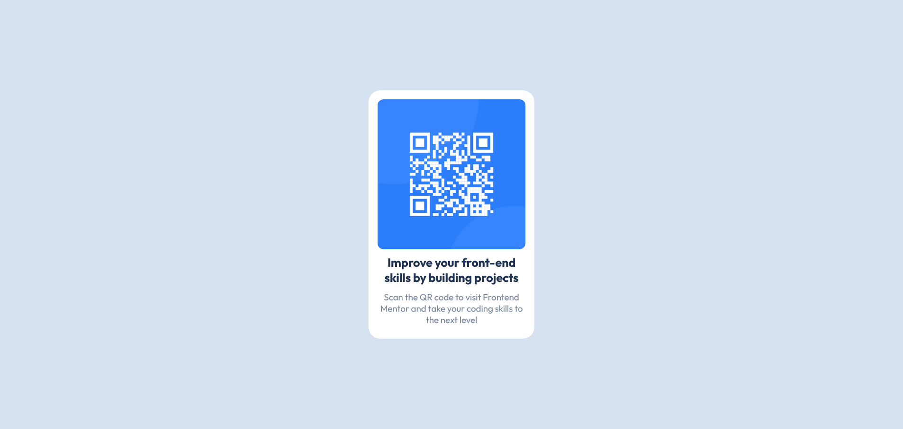

# Frontend Mentor - QR code component solution

This is a solution to the [QR code component challenge on Frontend Mentor](https://www.frontendmentor.io/challenges/qr-code-component-iux_sIO_H). Frontend Mentor challenges help you improve your coding skills by building realistic projects. 

## Table of contents

- [Overview](#overview)
  - [Screenshot](#screenshot)
  - [Links](#links)
- [My process](#my-process)
  - [Built with](#built-with)
  - [Continued development](#continued-development)
- [Author](#author)
- [Acknowledgments](#acknowledgments)

**Note: Delete this note and update the table of contents based on what sections you keep.**

## Overview

### Screenshot

## Take a look at the screenshot of the project

### Links

- Live Site URL: [Add live site URL here](http://127.0.0.1:5500/index.html)

## My process

### Built with

- Semantic HTML5 markup
- CSS custom properties
- Flexbox
- Mobile-first workflow

### Continued development

In future, I need to add more features to this website like user creating their profiles

## Author

- I am Asker Ahamed
- GitHub - [@AskerAhamed17](https://github.com/AskerAhamed17)

## Acknowledgments

I saw this project in the Frontend Mentor website. Thanks to them.
